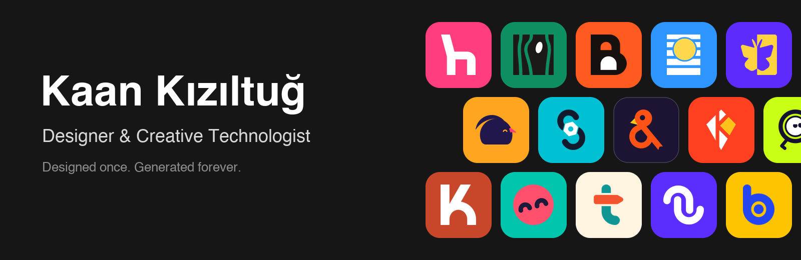

Designer and creative technologist with 7+ years of practice. I build brand, interface and growth systems, and extend them with AI: LLM agents with Claude, automation pipelines in n8n, and AI-assisted design workflows that turn one good design decision into many outputs.

- **Design:** brand systems, UI/UX and design systems in Figma
- **AI & automation:** Claude agents, n8n workflows, LLM-powered content and design pipelines
- **Growth:** funnels and marketing automation

**Open source:** [logo-design-skill](https://github.com/kaankiziltug/logo-design-skill), a designer's logo workflow for AI agents.

[Website](https://kaankiziltug.com) · [LinkedIn](https://www.linkedin.com/in/kaan-kiziltug/) · [X](https://x.com/kaankiziltug) · [Figma](https://www.figma.com/@kaankiziltug) · [Medium](https://medium.com/@kaankiziltug)
